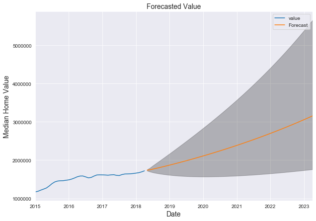
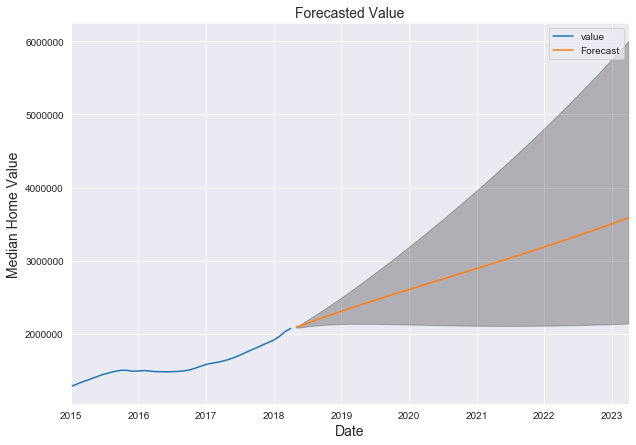

**Introduction:**

For the Module 4 Final Project, we will be examining a dataset from Zillow, of over 14,000 ZIP codes and their respective median home value. Our aim here is to narrow down to the 5 best ZIP codes for our stakeholders, a real estate investment company, to make an investment in. We will define our best investment in this case as low-risk with good return on investment (ROI) for 5 years. The way we have structured this project is by first dividing the data up into 3 equal portions by percentile of the dataset's median price distribution. We will then get the top 5-Year, 10-Year, and 15-year ROIs for each 1/3, and pick a least visually volatile trend from each set, making an ARIMA model for each.

# Obtaining Our Data

First, let's import our libraries necessary for this project

Let's now import the zillow data set and get a quick look at what it contains.

We can see there are 14,723 rows, which are all different zipcodes. We can also see the median house prices of each zipcode for every month from 1996 to 2018, with the months as columns. This makes our dataset wide format- something that will need to be adjusted to long format in order to run our model later on.

Right off the bat, we are only going to need to know the zipcode, and the median house prices, so all other columns can be dropped. After some referencing, we know that RegionName refers to the zipcode and that zipcodes which have only 4 numbers are actually zipcodes which begin with a 0 as this is mostly likely a pandas numerical format thing (not really an issue, just a note!).

While we are at it, let's rename 'RegionName' to 'zipcode'

# Data Preprocessing and Filtering

So there are a few missing values for the earlier months. This is due to the fact that some zipcodes are quite new!

After some initial domain research, I found that many real estate investment firms typically look at 5-year, 10-year, and over-10-year time frame for return on investment (ROI). As our data is still in wide-format, let's create a few additional columns that calculate for the most recent 5Y, 10Y, and 15Y ROI's (%) for each zip code. These values will be our assumed return on investments (ROI), if one were to purchased a home at those times.

Great! We have the 5-year, 10-year, and 15-year profit categories for each zipcode. Now let's do some filtering based on our most recent values. 
____

First, let's check the 5-point statistics for our set, and get an idea of the distribution of home values. Since we are planning on dividing up the values by 3, let's set our percentiles to roughly equal 1/3s. 

We can see that the mean value for April 2018 (most recent) for the entire set is ~ (about) 288,000, while the median is ~198,000. The 75th percentile is only ~321,000 and the max value of the set goes all the way to ~17,000,000. 

We want to give our stakeholders, the real estate investment firm, some options for investing. Narrowing our initial selection of zipcodes based on 3 levels most recent values such as might also help leverage what our stakeholders are considering high risk at the moment. Let's try splitting up our data based on the distribution of our dataset so that we have a roughly even amount of houses in each category : < 151,826 (33%), between 151,826 - 263,600 (33% - 66%), and > 263,600 (66%). 

## Top Zipcodes < 33rd Percentile
Top 2 ROIs for zipcodes where the median home value is under the 33rd percentile:

## Top Zipcodes in 33-66th Percentile
Top 2 ROIs for zipcodes where the median home value is between the 33rd and 66th percentiles:

## Top Zipcodes > 66th Percentile
Top 5 ROIs for zipcodes where the median home value is above the 66th percentile:

# EDA
## Under $151,000 USD

Let's define the helper function that melt's our data frame from wide format to date-time, long format for convenient graphing and also modeling later on.

Now, let's define another function for plotting the time series of any dataframe we feed into it.

### ROI Comparison

### Top 5-Year ROIs
Let's now melt down and plot our top 5 contenders under $151,000 for 5-year ROIs.

All 5 of these zipcodes suffered heavily in the 2007/'08 financial crisis. However, since hitting bottom, these zipcodes outperformed the rest in the last 5 years. We could say any of the 5Y zip code is a risky choice being that the median home price there dropped so heavily in the crisis (high volatility). 

Top Pick out of the top-5: None, too volatile.

Seeing this, we know we can reasonably give a longer time frame more importance. Let's check the 10-year investment contenders.
### Top 10-Year ROIs

There is considerably more stability in the top contenders for 10-year investments as opposed to the top 5-year investments. This would be an indicator of lower risk for us. 
Note: the 58563 area is missing the lower half of it's values because it is a newly-created zip code (for New Salem, North Dakota)- not a problem for now.

Our top Pick: 74740 seems to have the least volatility with a steady increase. As these 5 are all top profit performers out of thousands of zipcodes, we don't have to worry about #1 greatest profit and will be safer trusting our investment firms money in a less volatile environment.

### Top 15-Year ROIs

The top 5 contenders for 15-year investments also managed some resistance against the housing crisis, with slight dips. Remember, these 15-Year ROIs were much higher than 10-Year or 5-Year.

Our top pick: 38388 is visually the closet in stability to 74740, which have already chosen. 38388 also outperformed 74740 by about 40% in ROI.

## 151,000 - $263,600 USD

### ROI Comparison

### Top 5-Year ROIs

2 of the top 5 zips here dipped heavily in the '08 crisis (33460 - Lake Worth, FL), and the rest were mildly affected. 15201 however, seemed to be barely impacted at all, which is a good indicator of stability/low-risk.

Out Top Pick: 15201. Best stability.

### Top 10-Year ROIs

As we noticed in the low-tier valued homes, the 10-year ROIs were barely impacted by the crisis. ROIs here are quite stable upward trend, with some exponential rise in the last 10 years.

Top Pick: 15206. High returns and low volatility. Could be close to 15201 which we chose already.

### Top 15-Year ROIs

A bit of a mix here. 96772 (Naleehu, Hawaii) had a significant dip. 15201 (Pittsburgh, Pennsylvania) was steadily increasing throughout the crisis. Stability is good for investing! That could be a choice for our mid-tier valued homes.

Our Top Pick: 15213. It has the second best stability after 15201, which we chose already!

## Above $263,600 USD

### ROI Comparison

The top tier section of our data essentially is limitless as far as value. Some of these ZIP codes hit upwards of $15M in median value. 

Another note is that nearly all of these top profit ZIP codes are either in NYC or California (no big surprise there).

### Top 5-Year ROIs

Some volatility here. 80216 does well yet is either missing data or is a newly added zip code. 

Our Top pick: 94606. Ok volatility, and decent profits.

### Top 10-Year ROIs

Our top pick: 94043, minimal volatility, solid trend upwards!

### Top 15-Year ROIs

The top-tier valued 15-year ROIs were higher than all of the other categories. Some with dips during the crisis, however the post-crisis values far exceeded pre-crisis values. All zips here are in NYC or California.

Our Top Pick: 95389. This is actually a ZIP code out in Yosemite National Park, CA, (where there are homes). Given that it is well known now that many are moving out of NYC due to the coronavirus and prices are dipping, well-spaced lands are being sought out. 

## Top Pick: 15201 (Pittsburgh, Pennsylvania)

What we noticed during our EDA is that 15201 (Arsenal, Pittsburgh, Pennsylvania), a mid-tier median-value ZIP code, displayed strong stability and resistance to the financial crisis in 2008. This zipcode was the only one in all the top-5 for 5-year, 10-year, and 15-year investment return periods. As such, let's use this ZIP code for our baseline modeling.

**Why did this ZIP code do so well?**

Our theory: Big Tech. 5 of the top big tech companies also have moved into Pittsburgh since 2006, in large part due to the exceptional work performed by student researchers at Carnegie Mellon University, which many companies wanted to tap into. We are talking Google (moved in at 2006), Facebook, Apple, Microsoft, and Uber. This absolutely contributed to the rise in housing prices, because these companies hire and pay a lot of people. This potentially helped resist high volatility during the housing crisis.

Let's zoom in and see if we can observe any seasonal trends as people are less likely to move during the winter.

While the trend continues upwards, there appears to be a very slight slowing down during the winter months. People tend to move less during the winter due to the unsafe conditions.

Let's plot the rolling average/variance and see if it varies over time, using 6 as the window size (time period) for 6 months.

The standard deviation jumps up when the price value increase becomes exponential.  Note the y-scale though- 8000 is not a lot when the median goes up to $180k. 

Let's get a 10-year slice of our top pick, starting from the beginning of the housing crisis, and then plot each year.

With these yearly subplots, it is a bit easier to read the changes for each year. Following the 2008 crisis, there was in fact a small dip in value (about 1.4%) in 2009, which actually was completely recovered in rest of that same year. 2011 showed a decline in price (about 2.7%) throughout the entire year as well. Otherwise, all other years showed an increase.

Let's plot each of these 10 years on the same graph:

With all separate years on the same graph, we can easier visualize the nearly exponential increase in the recent years as the gaps between the lines are much wider on top.

Let's plot a boxplot for the sliced 10 years up until 2017.

This box plot helps visualize the period of consolidation following the financial crisis, and then the absolute explosion of value following 2013.

Let's now decompose our top pick to separate trend from seasonality and random residuals left after seasonality is removed.

We obviously knew there was a significant trend just by looking at our earlier plot of this time series. Seasonality however, was not so apparent because it's scale was so small. Taking a look at the y-axis values for the seasonality plot, we can see seasonality is present in a miniscule range (-0.0005 - 0.0005)

# BASELINE SARIMA MODEL: TOP PICK

Now that we've picked our top zip code, let's use it to create our baseline model. We will set a range of values for our best parameter search, for p, d, q, and P, D, Q, s.

'p' is the number of Auto-Regressive terms (the AR part of the model). It is basically the lag, incorporating the trends past values to provide predictions.

'd' is the number of differences (I, integrated) that our model subtracts from the current observation.

'q is the number of moving average terms (the MA part), which sets the error as a linear combo of the error values observed from previous time points.

The capital variables are the same idea for seasonality.
___

As we noticed very slight seasonality, let's experiment running SARIMA (keeping the seasonality portion).

We will set our p, d, q parameter range between 0 and 2 for starters.

Now let's use a nested for loop to iterate through all combinations of parameter values into the SARIMA model.

Let's now find which combo of parameters gave us the minimum AIC value.

Let's now plug these best parameters into a new model and print the output summary table.

Top right: Our data is normally distributed for the most part, which is good, however the N(0,1) does not follow as well as we'd like.

Bottom left: ordered distribution of residuals (blue dots) show that we are not really following the linear trend of samples taken from the normal distribution so well.

Bottom right: Our auto-correlation plot shows that the time series residuals have some correlation with lagged versions of itself. 
____
As we are not able to confirm the assumptions of the ARIMA model, we will need some further tweaking here. Let's calculate the RMSE to get a baseline error as a benchmark.

    The Root Mean Squared Error of our forecasts is 958.42149

So our RMSE is about 958. This means that our predictions are off by about 958 dollars out of 160k - not too bad. 

## Modifying SARIMA Model
Let's try improving our previous RMSE by widening the parameters in our loop to a range between 0 and 2.

NOTE: This next cell may take a long time to run (24 min for us!).

Let's now find which combo of parameters gave us the minimum AIC value.

Our AIC is a bit lower now.
Let's plug these new parameters into a new model and run it.

All of our components are now within the p-value significance threshold of 0.05- a good sign.

Slight improvements in histogram/density curve, and correlogram. Q-Q plot residuals still a bit off though.
Let's get the RMSE for this new model.

    The Root Mean Squared Error of our forecasts is 951.36786

Our RMSE did improve (lower) a tad down to 951, from 958.

## Mod #2 ARIMA Model
Let's see if we can improve on our RMSE by removing the seasonality portion of our model because of how small the range was. (This may be technically a sacrifice to speed up our model computation.)

Our residuals remain correlated and the assumptions of the ARIMA model are violated so we can't use this model.

    The Root Mean Squared Error of our forecasts is 876.07315

Interesting, our error actually went even lower without the seasonality! However due to the worsened assumption violations of this model, we need to tweak the parameters.

Let's try taking the log of our top zip code and fitting the ARIMA model again 
## Log Data

Using the log of our time series gave us considerably better results as far as assumptions. The end residuals on the bottom right however are slightly correlated lagged versions of itself. This may be due to the random spikes of noise that we can see in the of the top right graph.

. Let's plot the predictions and get the RMSE.

We can see that our predictions follow our trend quite closely.

    The Root Mean Squared Error of our forecasts is 921.97635

Our RMSE improved again! Down to 921.9. 

Let's now plot our median value forecast for 15201!

    Model 5-Year Forecasted ROI rate: 82.20%

For our last attempt, let's bring back seasonality with our log transformed data.

### MOD #4, Seasonal Log Data

**NOTE: This will take at least 20 minutes to run!**

Our residuals correlation is a bit worse now.

    The Root Mean Squared Error of our forecasts is 960.28412

Worse RMSE. 

Let's go with our non-seasonal log-model!

## Modeling our narrowed-down top zip codes list to last 4/5 top ZIPs:

As our model will likely need some tuning for each different time series/ZIP code, let's make define a function for the parameter tuning, modeling process, and predictions to save space.

From here on, we will be taking the top contenders based on what we visualized in the time series plots for top ROIs in each tier's subgroup.

### 74740*

Our model didn't get the best ROI compared to the others, however the RMSE is quite low comparatively.

### 38388

As this model's p-values are all under the significance threshold, and the model is predicting a 44% return, it is a top contender!

### 15206*

15206 is actually another zip code is Pittsburgh! The Forecasted ROI rate is 53%, and the confidence interval display almost certain increase in valuation. Top 5!

### 15213

### 94606

### 11222*

### 94043*

The confidence interval for 94043 is saying almost definite increase in this top-tier valued zipcode. 71.3244% forecasted ROI. Top 5!

### 95389

# Interpretation of Results

So we created our model to the tune of our top pick ZIP code, 15201 (Pittsburgh, PA). Our optimal parameter search without seasonality gave us the best RMSE. This was likely due to the fact that the seasonality that we did observe was on such a small scale that it was insignificant. For this reason, we left seasonality out of the modeling function we used to run on the list of our narrowed-down top contenders for investments. Looking at not only profit, but the confidence interval, we made our choices and have come up with the following top 5 ZIP codes:

74740 Low-Tier Value, Forecasted 5-Year ROI: 28.5961% (McCurtain County, Oklahoma)

38388 Low-Tier Value, Forecasted 5-Year ROI: 44.3059% (Henderson County, Tennessee)

15206 Mid-Tier Value, Forecasted 5-Year ROI: 53.6248% (Pittsburgh, PA)

15201 Mid-Tier Value, Forecasted 5-Year ROI: 158.1702% (Pittsburgh, PA)

94043 High-Tier Value, Forecasted 5-Year ROI: 71.3244% (Santa Clara County, California)
